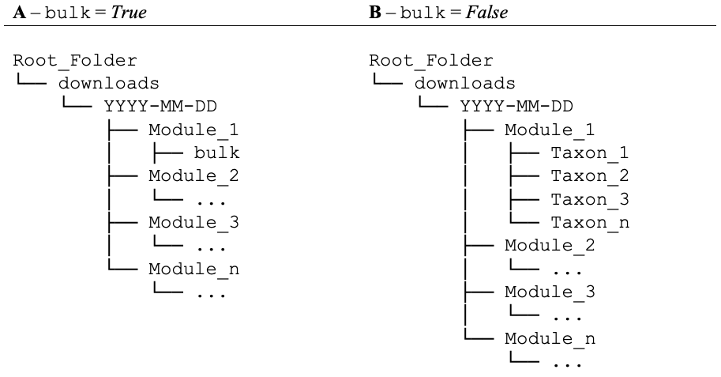

Main functionalities and workflow
=================================

.. _installation:

Before using ``biodumpy``, users need to install the package in their Python environment. To install the stable version, use the following command:

.. code-block:: console

   pip install biodumpy

For those interested in the development version, the package is downloadable from TestPyPI with the following command:

.. code-block:: console

    pip install -i https://test.pypi.org/simple/ biodumpy --extra-index-url https://pypi.org/simple/.

Alternatively, if you are using an IDE like `PyCharm`_ or `Visual Studio`_, you can install the package via the Python Packages tool.

.. _`PyCharm`: https://www.jetbrains.com/pycharm/?source=google&medium=cpc&campaign=EMEA_en_ES_PyCharm_Branded&term=pycharm&content=698987581572&gad_source=1&gclid=EAIaIQobChMIvJCN3reQiQMVyJpoCR2yswprEAAYASAAEgKRhPD_BwE

.. _`Visual Studio`: https://code.visualstudio.com/

.. warning::

    Windows users may need to install the `Microsoft C++ Build Tools`_.

.. _`Microsoft C++ Build Tools`: https://visualstudio.microsoft.com/it/visual-cpp-build-tools/

Usage
-----

To make ``biodumpy`` easier to use, we have designed a general structure that is consistent across all modules. Below is an overview of the main steps to get started with the package:

1) **Load the package.** Import ``biodumpy`` into your Python environment.
2) **Load the desired modules.** Import one or more specific modules needed to retrieve the data.
3) **Set up the configuration of one or more modules.** Configure the ``biodumpy`` function/s with the required parameters.
4) **Start the download.** Execute the function to begin retrieving the data.

Examples
--------

Here, we provide two examples illustrating the general structure of a ``biodumpy``. In detail, we described:

- **Example n.1 - Single Module**. We demonstrate how to use a single ``biodumpy`` module (e.g., GBIF).
- **Example n.2 - Multiple Modules**. We show how to use multiple ``biodumpy`` modules (e.g., GBIF and COL).

Example n.1
~~~~~~~~~~~

.. code-block:: python

    # Import biodumpy package
    from biodumpy import Biodumpy

    # Import GBIF module
    from biodumpy.inputs import GBIF

    # Create a list of taxa
    taxa = ['Alytes muletensis', 'Bufotes viridis', 'Hyla meridionalis', 'Anax imperator']

    # Set the biodumpy function with the specific parameters
    bdp = Biodumpy([GBIF(bulk=False, accepted_only=True)])

    # Start the download
    bdp.start(taxa, output_path='./downloads/{date}/{module}/{name}')

Example n.2
~~~~~~~~~~~

.. code-block:: python

	# Import biodumpy package
	from biodumpy import Biodumpy

	# Import GBIF and COL modules
	from biodumpy.inputs import GBIF, COL

	# Create a list of taxa
	taxa = ['Alytes muletensis', 'Bufotes viridis', 'Hyla meridionalis', 'Anax imperator']

	# Set the biodumpy functions with the specific parameters
	bdp = Biodumpy([GBIF(bulk=True, accepted_only=True),
					COL(bulk=True)])

	# Start the download
	bdp.start(taxa, output_path='./downloads/{date}/{module}/{name}')

The ``bulk`` parameter
----------------------

An important parameter common to all modules is ``bulk``. This parameter controls how information is organized and saved, allowing users to customize the data structure according to their needs (Fig. 1).

- If ``bulk`` is *True*, the information downloaded for each taxon is merged into a single file. This option may be useful if the amount of the total data is limited and for consolidating data and simplifying file management.

- If ``bulk`` is *False*, the information for each taxon is saved in a separate file. This option is useful for detailed analysis, when individual taxon files are required or when the amount of data for each taxon is large.

Save result location
--------------------

By default, ``biodumpy`` saves the resulting file in a folder named *downloads* within the user's working directory. Inside this folder, a subfolder is automatically created, named after the current date. Within that, additional subfolders are generated, each named after the corresponding module(s) used (Fig. 1).

**Fig.1** Folder hierarchy structure with the distinction based on the bulk parameter being set to either True (A) or False (B).
